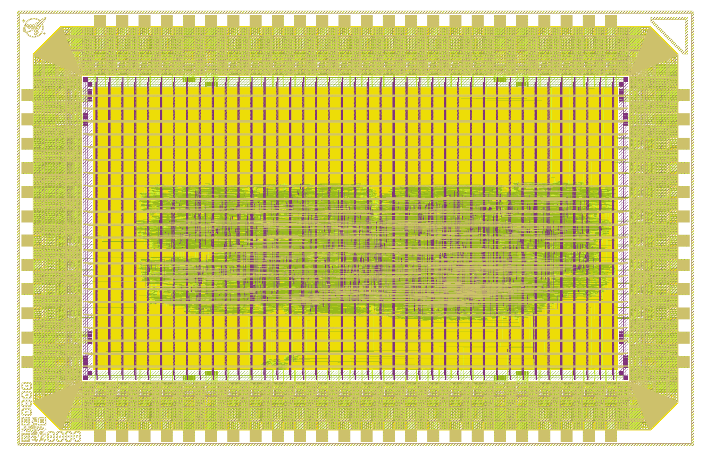

# EuroSynth 🎛️🔊

A **kitchen-sink synthesizer voice in custom silicon** — a fully digital eurorack
synth voice taped out on the open-source **GlobalFoundries 180 nm (GF180MCU)** PDK with
the LibreLane RTL-to-GDSII flow.

<p align="center">
  
</p>

A small, bulletproof **spine** owns the audio timing, mixes a bank of **isolated sound
engines**, and streams 16-bit audio to an external DAC. Engine #1 — a **Karplus-Strong
plucked string** — is verified *bit-exact* against a golden reference and hardened to a
**clean, manufacturable GDSII**:

> **DRC = 0 · LVS = 0 · antenna = 0 · power-grid = 0** — manufacturability report all-pass.
> Die 3.93 mm × 2.53 mm (9.95 mm²), 66,906 standard cells, 5 V.

## 📖 Documentation

| Doc | What's in it |
|---|---|
| **[docs/SHOWCASE.md](docs/SHOWCASE.md)** | The flagship write-up: what it is, the silicon achievement & signoff, architecture, the Karplus-Strong engine, specs, and pinout. **Start here.** |
| **[docs/HARDWARE_GUIDE.md](docs/HARDWARE_GUIDE.md)** | Build it: power/clock/reset, a sample circuit for **every pad**, a "hello world" first-light test, two audio output options, and a ready-to-run Arduino controller. |
| **[NOTES.md](NOTES.md)** | Design rationale — *why* it looks the way it does; the engine contract; the roadmap. |
| **[docs/karplus_strong.md](docs/karplus_strong.md)** | The KS engine spec: integer algorithm, fixed-point analysis, golden-vector test plan. |
| **[PLAN.md](PLAN.md) · [PROGRESS.md](PROGRESS.md)** | Build plan and the full status log (incl. the GDSII hardening run). |

## 🗂️ Source

| Path | Role |
|---|---|
| [src/synth_spine.sv](src/synth_spine.sv) | Timing spine: tick gen, voice mux, I2S serializer, bypass ramp |
| [src/ks_engine.sv](src/ks_engine.sv) | Karplus-Strong plucked-string engine |
| [src/chip_core.sv](src/chip_core.sv) | Pad-interface wiring (the `1x0p5` pin map) |
| [src/chip_top.sv](src/chip_top.sv) | Template top / I/O pad ring |
| [models/ks_ref.py](models/ks_ref.py) · [models/ks_golden.hex](models/ks_golden.hex) | Bit-exact reference model + golden vector |
| [tb/](tb/) | Self-checking testbenches (KS golden, spine round-trip, elaboration) |

## ✅ Verification

Runs on a plain open-source simulator, no PDK required:

```bash
bash scripts/sim.sh bash -lc 'iverilog -g2012 -o /tmp/ks.vvp    src/ks_engine.sv tb/tb_ks_engine.sv && vvp /tmp/ks.vvp'      # KS OK   256/256
bash scripts/sim.sh bash -lc 'iverilog -g2012 -o /tmp/spine.vvp src/synth_spine.sv src/ks_engine.sv tb/tb_synth_spine.sv && vvp /tmp/spine.vvp'  # SPINE OK
```

## 🛠️ Built with

GF180MCU PDK · LibreLane · OpenROAD · Yosys · Magic · KLayout · Netgen, on the
[wafer.space gf180mcu-project-template](https://github.com/wafer-space/gf180mcu-project-template).

## 📜 License

Apache-2.0 (see [LICENSE](LICENSE) and [AUTHORS.md](AUTHORS.md)).
