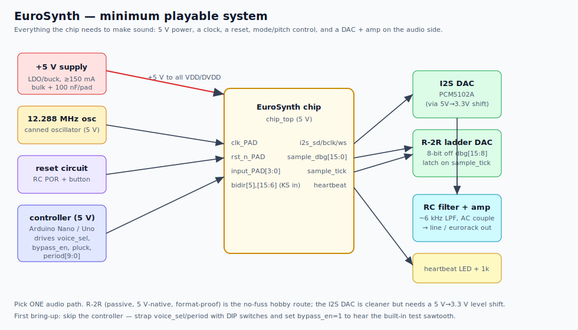

# EuroSynth — hardware bring-up & sample circuits

How to wire the chip up and make it sing. This is the companion to
[SHOWCASE.md](SHOWCASE.md) (what the chip *is*). Here we cover **power, clock, reset,
a sample circuit for every pad, a "hello world" first-light test, two audio output
options, and a ready-to-run Arduino controller.**



> ⚠️ **Read this first — electrical basics**
> - The chip is **5 V**, single supply. Core and I/O rails are tied: feed **+5 V** to
>   every `VDD`/`DVDD` pad and **0 V** to every `VSS`/`DVSS` pad.
> - All digital I/O is **5 V CMOS.** A logic high is ≳ 3.5 V, a low ≲ 1.5 V.
> - **Input pads have NO internal pull resistors.** Any input you don't actively
>   drive **must** get an external pull (10 kΩ) or it floats and the chip misbehaves.
> - Output pads are **24 mA** tri-state drivers — strong enough for LEDs, resistor
>   ladders, and logic inputs directly.
> - **Run the clock at ≤ ~16 MHz** (12.288 MHz recommended). Higher risks setup-timing
>   failures (see the [timing note in the showcase](SHOWCASE.md#one-honest-caveat-clock-speed)).

---

## 1. Bill of materials (minimum playable system)

| Qty | Part | Purpose |
|----:|------|---------|
| 1 | EuroSynth chip (`chip_top`) | the synth |
| 1 | 5 V regulator (LDO/buck, ≥ 150 mA) e.g. MCP1700-5002 / LM7805 | power |
| 1 | 12.288 MHz **canned oscillator** (full-can, 5 V, CMOS out) | clock |
| ~18 | 100 nF ceramic capacitor | per-pad decoupling |
| 1 | 10 µF + 1 µF capacitor | bulk decoupling |
| 1 | 10 kΩ resistor + 1 µF cap + tactile button | power-on reset |
| 1 | (optional) MCP130-450 / DS1233 reset supervisor | clean reset |
| 1 | 4-way DIP switch + 4× 10 kΩ | voice_sel + bypass_en |
| 1 | 10-way DIP switch + 10× 10 kΩ | ks_period (static pitch) |
| 1 | tactile button + 10 kΩ + 100 nF + 74HC14 | debounced pluck |
| — | **Audio path A (recommended):** 8–16× 10 kΩ + 8–16× 20 kΩ (R-2R) + 74HC574 + 74HC04 + TL072 | parallel DAC |
| — | **Audio path B:** PCM5102A I2S DAC board + 74LVC245 (3.3 V) | clean I2S DAC |
| 1 | LED + 1 kΩ | heartbeat indicator |
| 1 | (optional) **Arduino Nano/Uno (5 V)** | programmable controller |

---

## 2. Power & ground

Tie all the power pads together and decouple generously — the synchronous logic
switches hard at each clock edge.

```
        +5V o─────┬───────┬───────┬───── ... to every VDD / DVDD pad
                  |       |       |
                 ===10µF ===1µF  === 100nF  (one 100nF close to EACH power pad)
                  |       |       |
        GND o─────┴───────┴───────┴───── ... to every VSS / DVSS pad
```

- One **100 nF** ceramic as physically close as possible to **each** of the 16
  power/ground pad pairs.
- One **10 µF + 1 µF** bulk pair near the chip.
- Keep the ground return short and wide (ground pour).

---

## 3. Clock — `clk_PAD`

`clk_PAD` is a **Schmitt-trigger** input, so it's happy with a clean square wave from a
canned oscillator. This is the simplest, most reliable option:

```
   +5V
    |
  [ 4-pin 12.288 MHz oscillator can ]
    |  OUT ──────────────► clk_PAD
   GND                      (add 100nF on the can's Vcc)
```

- **12.288 MHz → fs = 12 kHz** (clk / 1024), BCLK = 384 kHz. Clean round audio numbers.
- Any clock works; the sample rate and all pitches just scale with it. Stay **≤ ~16 MHz**.
- A crystal + gate oscillator works too, but a full-can oscillator removes all the guesswork.

---

## 4. Reset — `rst_n_PAD`

Active-low, synchronous. Hold it **low** through power-up, then release **high** to run.
A simple RC power-on reset plus a manual button:

```
   +5V
    |
   [10k]
    |
    ├──────────────────────────► rst_n_PAD
    |
   [1µF]        [tactile button]
    |               |
   GND ─────────────┘   (press = force reset low)
```

- At power-up the cap charges through 10 kΩ (~10 ms): `rst_n` ramps from 0 → 5 V, so
  the chip starts held in reset and releases once the rail is stable.
- The button discharges the cap to re-reset on demand.
- **For a robust product**, replace the RC with a **reset supervisor** (MCP130-450,
  DS1233): a clean, glitch-free, monotonic edge regardless of how the 5 V ramps.

---

## 5. Control inputs

### 5a. `voice_sel[2:0]` + `bypass_en` — `input_PAD[3:0]`

These pick which engine plays. **No internal pulls**, so use switches *with* pull-downs
(switch open = 0, closed = 1):

```
   +5V
    |
   [DIP switch bit]
    |
    ├───────────────► input_PAD[n]
    |
   [10k]
    |
   GND
```

| `input_PAD[3:0]` | binary | Result |
|---|---|---|
| `0 100` | voice_sel=4 | **Karplus-Strong** (play this!) |
| `1 xxx` | bypass_en=1 | **force test ramp** (use for first light) |
| `0 000` | voice_sel=0 | bypass ramp via the mux |
| `0 001` / `0 010` | 1 / 2 | saw / square placeholder oscillators |
| `0 011` | 3 | silence |

(Bit order: `input_PAD[3]` = bypass_en, `[2:0]` = voice_sel MSB→LSB.)

### 5b. `ks_period[9:0]` — `bidir_PAD[15:6]` (pitch)

The 10-bit delay length N sets the pitch: **f ≈ fs / N** (≈ 12 kHz / N at the
recommended clock). Each bit is an input pad needing a defined level. For a fixed
note, a 10-way DIP switch with pull-downs (same circuit as above) on `bidir_PAD[6..15]`:

| `ks_period` bit | Pad | | Example N | Pads to set HIGH | Pitch @ fs=12 kHz |
|---|---|---|---|---|---|
| period[0] (LSB) | `bidir_PAD[6]` | | **N = 48** | 10, 11 | ~250 Hz |
| period[1] | `bidir_PAD[7]` | | **N = 92** | 8, 9, 10, 12 | ~130 Hz (≈ C3) |
| period[2] | `bidir_PAD[8]` | | **N = 24** | 9, 10 | ~500 Hz |
| … | … | | **N = 255** | 6–13 | ~47 Hz (lowest) |
| period[9] (MSB) | `bidir_PAD[15]` | | **N = 2** | 7 | ~6 kHz (highest) |

> To set N: write N in binary across `bidir_PAD[6]`(LSB) … `bidir_PAD[15]`(MSB).
> e.g. N = 48 = `0b00_0011_0000` → bits 4 and 5 set → `bidir_PAD[10]` and `[11]` HIGH.

### 5c. `ks_pluck` — `bidir_PAD[5]` (the trigger)

A pluck (re)excites the string. The pad feeds the engine directly with **no edge
detector**, so it wants a clean, bounce-free transition. Use an RC + Schmitt debounce:

```
   +5V
    |
   [10k]
    |
    ├──[10k]──┬────────────[74HC14]────► bidir_PAD[5]  (ks_pluck)
    |         |             (Schmitt inverter ×2, or 1 + invert in logic)
 [button]   [100nF]
    |         |
   GND       GND
```

- A debounced press → exactly **one** pluck → one note rings and decays.
- **Behavior note:** while `pluck` is held high the engine re-arms and holds its output;
  the new note actually *starts when you release.* For a quick tap this is imperceptible.
  For perfectly clean, press-to-sound triggering, drive `pluck` from a microcontroller
  that pulses it high for a few microseconds (see §8) — that also lets you sequence notes.

---

## 6. Audio output — two ways

### Path A (recommended): parallel R-2R DAC — 5 V-native, format-proof

The chip mirrors each sample on a **parallel bus** `sample_dbg[15:0]`
(`bidir_PAD[31:16]`) and strobes `sample_tick` (`bidir_PAD[4]`) once per sample. Latch
the bus on that strobe and feed a resistor-ladder DAC. No I2S decoding, no level
shifting. An 8-bit ladder off the **top 8 bits** is plenty for a gorgeous lo-fi tone:

```
 bidir_PAD[31:24] = sample_dbg[15:8]  (top 8 bits; [31]=sign)
        │
        ▼
   [ 74HC574 octal D-FF ]  ◄─── clock = sample_tick (bidir_PAD[4])
        │ Q7..Q0
        │   └── Q7 (the SIGN bit) ──[74HC04 inverter]──┐  (invert MSB:
        │                                              │   two's-complement → offset-binary)
        ▼                                              ▼
   ┌─────────── R-2R ladder (R=10k, 2R=20k) ───────────┐
   bit7 ─[2R]─┬─[2R]─┬─ ... ─┬─[2R]─ bit0               │
              R      R       R                          │
              │      │       │                          ▼
             ...    ...     ... ──[R]── Vout ──[1µF]──┬──[RC LPF ~6kHz]──► audio out
                                                      │
                                                   [100k to 2.5V bias]
```

- **Latch:** 74HC574, clocked by `sample_tick`, holds the sample steady between updates.
- **Sign fix:** `sample_dbg` is **signed two's-complement**. Invert the MSB
  (`sample_dbg[15]`, i.e. the latched Q7) with one inverter to convert it to
  offset-binary, which the ladder renders as a clean bipolar waveform centered at
  mid-scale (≈ 2.5 V).
- **Filter/buffer:** AC-couple (1 µF) to strip the 2.5 V DC, low-pass at ~6 kHz
  (R-C, e.g. 2.7 kΩ + 10 nF) to smooth the steps, buffer with a TL072/MCP6002 op-amp,
  then out to a line jack or a eurorack output stage.
- Want full 16-bit? Use all of `sample_dbg[15:0]` (`bidir_PAD[31:16]`) with two 74HC574s
  and a 16-bit ladder of 0.1 % resistors — or a parallel-input DAC IC.

### Path B: I2S DAC (cleaner digital path)

Connect the 3-wire I2S stream to an I2S DAC such as **PCM5102A** (it generates its own
system clock, so BCLK + LRCK + DATA suffice):

| Chip pad | → DAC |
|---|---|
| `bidir_PAD[0]` `i2s_sd` | DIN |
| `bidir_PAD[1]` `i2s_bclk` | BCK |
| `bidir_PAD[2]` `i2s_ws` | LRCK |

- The chip's outputs are **5 V**; PCM5102A inputs are **3.3 V**. Put a **74LVC245**
  (powered at 3.3 V, 5 V-tolerant inputs) or a level-shifter on the three lines.
- The serializer is **left-justified-style** (MSB coincides with the LRCK edge, 16-bit,
  32 BCLK/frame). Set the DAC to **left-justified** format if it has a format select,
  and verify the bit alignment on a scope. (This is the one format nuance flagged in
  [NOTES.md](../NOTES.md) — Path A sidesteps it entirely.)

---

## 7. Status outputs

### `heartbeat` — `bidir_PAD[3]`

```
  bidir_PAD[3] ──[1kΩ]──►|── GND      (LED)
```

Toggles at ≈ **fs / 1024 ≈ 12 Hz** at the recommended clock — a quick visible flicker
that proves the clock *and* the audio-tick generator are alive. (Scope it for a clean
~12 Hz square wave.)

### `sample_tick` — `bidir_PAD[4]`

The audio-frame strobe (= fs ≈ 12 kHz). Doubles as the **latch clock for the R-2R DAC**
(§6A) and a handy scope trigger to see one sample per pulse.

---

## 8. The Arduino companion (programmable brain)

An **Arduino Uno/Nano is 5 V native**, so it wires **directly** to the chip — no level
shifting. Let it drive all the controls and you have a sequencer/keyboard. Direct wiring
uses 15 GPIO (use a 74HC595 shift register if you want to save pins):

| Arduino pin | → Chip pad | Function |
|---|---|---|
| D2 | `input_PAD[0]` | voice_sel[0] |
| D3 | `input_PAD[1]` | voice_sel[1] |
| D4 | `input_PAD[2]` | voice_sel[2] |
| D5 | `input_PAD[3]` | bypass_en |
| D6 | `bidir_PAD[5]` | ks_pluck |
| D7…D13, A0, A1, A2 | `bidir_PAD[6…15]` | ks_period[0…9] |
| GND | any `VSS`/`DVSS` | common ground |

> Because the Arduino drives these pins push-pull, no external pull resistors are needed
> on Arduino-controlled lines. (If the Arduino can be disconnected/unpowered while the
> chip runs, add 10 kΩ pull-downs so the inputs don't float.)

```cpp
// EuroSynth — minimal Karplus-Strong note player (Arduino Uno/Nano, 5V)
const uint8_t VSEL[3] = {2, 3, 4};      // voice_sel[2:0]
const uint8_t BYPASS  = 5;              // bypass_en
const uint8_t PLUCK   = 6;              // ks_pluck
const uint8_t PERIOD[10] = {7,8,9,10,11,12,13, A0, A1, A2}; // ks_period[0..9]

void setPeriod(uint16_t n) {            // n = delay length (2..255); pitch ~ fs/n
  for (uint8_t i = 0; i < 10; i++)
    digitalWrite(PERIOD[i], (n >> i) & 1);
}

void pluck() {                          // clean ~3 us strobe -> one note
  digitalWrite(PLUCK, HIGH);
  delayMicroseconds(3);
  digitalWrite(PLUCK, LOW);
}

void setup() {
  for (uint8_t i = 0; i < 3; i++) pinMode(VSEL[i], OUTPUT);
  pinMode(BYPASS, OUTPUT); pinMode(PLUCK, OUTPUT);
  for (uint8_t i = 0; i < 10; i++) pinMode(PERIOD[i], OUTPUT);

  digitalWrite(BYPASS, LOW);            // don't force the test ramp
  digitalWrite(VSEL[2], HIGH);          // voice_sel = 4 (100b) = Karplus-Strong
  digitalWrite(VSEL[1], LOW);
  digitalWrite(VSEL[0], LOW);
}

// A little riff (delay-line lengths N; smaller N = higher pitch)
const uint16_t song[] = {92, 92, 61, 92, 123, 92, 46, 61};
void loop() {
  for (uint8_t i = 0; i < sizeof(song)/sizeof(song[0]); i++) {
    setPeriod(song[i]);
    pluck();
    delay(300);                          // note length (ms)
  }
  delay(600);
}
```

---

## 9. "Hello world" — first light

Bring the board up in this order; each step proves one thing before the next:

1. **Power.** Apply 5 V. Confirm the rail is clean (scope for ringing). Nothing should
   get hot.
2. **Clock.** Confirm 12.288 MHz on `clk_PAD` with a scope/counter.
3. **Reset.** On power-up `rst_n` should sit low (~10 ms) then go high. Tie/leave it high.
4. **Prove life with the test ramp.** Set **`bypass_en = 1`** (`input_PAD[3]` high).
   This forces the built-in sawtooth straight to the serializer, *independent of any
   engine*:
   - The **heartbeat LED** flickers (~12 Hz) → clock + tick generator are alive.
   - Your audio path outputs a **~187 Hz sawtooth buzz** → power, clock, serializer, and
     DAC are all working. **This is the single most important bring-up checkpoint.**
5. **Play the string.** Set `bypass_en = 0`, `voice_sel = 4` (`input_PAD[2:0] = 100`),
   set a period (e.g. N = 48 → `bidir_PAD[10]`,`[11]` high), and **pluck**
   (`bidir_PAD[5]`). You should hear a plucked-string tone that rings and decays. Change
   N (or let the Arduino sequence it) to play notes.

---

## 10. Spare & reserved pads

| Pads | What to do |
|---|---|
| `bidir_PAD[45:32]` | Outputs driving logic 0 — leave **unconnected**. |
| `bidir_PAD[15:5]` not used as inputs | Already covered (pluck/period). |
| `analog_PAD[3:0]` | Reserved 5 V analog pads, not wired to logic inside. Leave **floating** (or route to test points for future CV / audio-in / entropy experiments). |

---

## 11. Troubleshooting

| Symptom | Likely cause |
|---|---|
| No heartbeat, no audio | No clock, or reset stuck low. Scope `clk_PAD` and `rst_n_PAD`. |
| Heartbeat OK but silence | Audio path issue — verify with `bypass_en = 1` first (step 4). Check the R-2R latch is clocked by `sample_tick` and the sign (MSB) is inverted. |
| Garbled / wrapping waveform on R-2R | MSB (sign bit) not inverted → two's-complement fed to an unsigned ladder. Invert `sample_dbg[15]`. |
| Random / changing behavior | A control input is floating. Every undriven input needs a 10 kΩ pull-down (no internal pulls). |
| Plucks but won't ring / re-triggers | `pluck` bouncing or held — debounce it, or drive a short pulse from the Arduino. |
| Works at low clock, flaky when you speed it up | You exceeded the safe clock. Stay **≤ ~16 MHz** (12.288 MHz recommended). |
| I2S DAC outputs noise/garbage | Format mismatch (set DAC to left-justified) or 5 V→3.3 V level shift missing. Prefer Path A. |

---

*See [SHOWCASE.md](SHOWCASE.md) for the architecture and the silicon signoff results,
and [NOTES.md](../NOTES.md) for the design rationale.*
