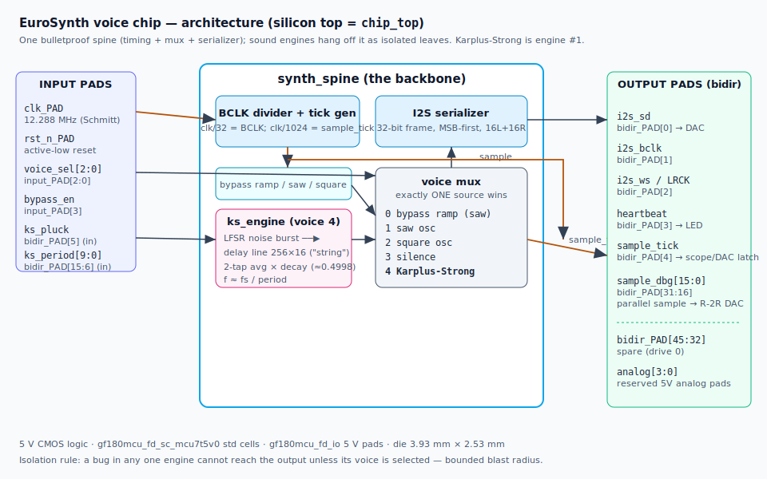
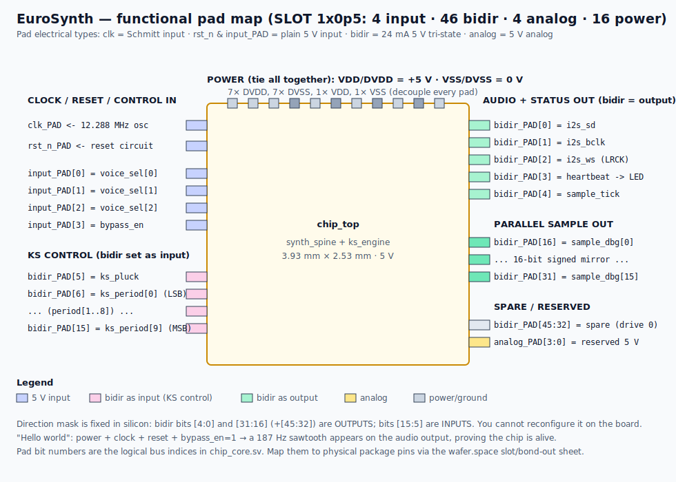

# EuroSynth — a kitchen-sink synthesizer voice, in custom silicon

> A fully digital **eurorack synth voice** taped out on the **GlobalFoundries 180 nm
> (GF180MCU)** open PDK. One bulletproof "spine" generates the audio timing, mixes a
> bank of isolated sound engines, and streams 16-bit audio to an external DAC. The
> first real engine is a **Karplus-Strong plucked string** — verified *bit-exact*
> against a golden reference, then hardened all the way to a **clean, manufacturable
> GDSII** (DRC / LVS / antenna all pass).

<p align="center">
  
  <br>
  <em>The actual layout: a 3.93 mm × 2.53 mm die. The yellow mesh is the top-metal
  power grid; the dense field beneath it is the Karplus-Strong delay line, the spine,
  and the I2S serializer. The frame is the I/O pad ring.</em>
</p>

> 🎧 **Hear it first:** the **[live in-browser playground](https://anfroholic.github.io/eurosynth/web/)**
> runs all five voices from the chip's bit-exact reference models (WebAssembly / PyScript)
> — sample-for-sample what the silicon produces, no install.

---

## TL;DR

| | |
|---|---|
| **What** | A digital synthesizer voice ASIC — timing spine + isolated sound engines + I2S audio out |
| **Process** | GF180MCU (GlobalFoundries 180 nm), **5 V** logic and I/O |
| **First engine** | Karplus-Strong plucked string (16-bit, fully integer, deterministic) |
| **Die size** | 3.93 mm × 2.53 mm = **9.95 mm²** (half-slot, `1x0p5`) |
| **Complexity** | 66,906 standard cells; 168,278 placed instances |
| **Flow** | LibreLane v3.1.0.dev1 (open-source RTL→GDSII) on the wafer.space template |
| **Signoff** | **DRC = 0, LVS = 0, antenna = 0, power-grid = 0 — manufacturable** ✅ |
| **Verification** | Karplus-Strong RTL matches its golden vector **256/256 samples, 0 mismatches** |

This document shows off *what it is and how it works*. For **building hardware around
it** — power, clock, reset, and a sample circuit for every pad — see
[HARDWARE_GUIDE.md](HARDWARE_GUIDE.md).

---

## The headline: it's real silicon, and it's clean

The design was pushed through the complete open-source digital flow (synthesis →
floorplan → power grid → placement → clock tree → routing → signoff → GDSII) and
**passed every physical signoff check** a tapeout cares about:

| Signoff check | Tool | Result |
|---|---|---|
| Design Rule Check (geometry) | Magic | **0 violations** ✅ |
| Design Rule Check (geometry) | KLayout | **0 violations** ✅ |
| Routing DRC | OpenROAD | **0** (converged 130 → 23 → 16 → 0) ✅ |
| Metal density | KLayout | **0 violations** ✅ |
| **Layout-vs-Schematic** | Netgen | **0 device / net / pin mismatches** ✅ |
| Antenna effect | OpenROAD + KLayout | **0 violating nets / pins** ✅ |
| Power-grid integrity | OpenROAD PSM | **0 violations** ✅ |
| Unmapped cells / flow errors | LibreLane | **0 / 0** ✅ |

> **LVS = 0** is the one that matters most: it proves the physical layout is an exact
> electrical match for the verified netlist. The transistors on the die *are* the
> circuit we simulated — nothing got lost in translation.

LibreLane's own manufacturability report is unambiguous:

```
* Antenna   Passed
* LVS       Passed
* DRC       Passed
```

### Physical vitals

| Metric | Value |
|---|---|
| Die area | 3932 µm × 2531 µm = **9.95 mm²** |
| Core area | 3047 µm × 1642 µm ≈ 5.0 mm² |
| Core utilization | ~37.5 % (deliberate headroom for routing/timing) |
| Standard cells | 66,906 |
| Total instances (incl. fill/tap/diode) | 168,278 |
| Antenna-fix diodes inserted | 81 |
| Hold-fix buffers inserted | 3,643 (hold timing **fully closed**) |

---

## How it works



### The spine: one backbone, many isolated engines

The core idea is a **"kitchen-sink" synth that stays safe by isolation.** A small,
heavily-verified backbone — the **spine** ([`synth_spine.sv`](../src/synth_spine.sv)) —
owns everything fragile:

1. **It owns timing.** The I2S serializer is the clock master: it emits exactly one
   `sample_tick` pulse per audio frame. *Every* sound engine advances its state only
   on that tick, so the whole chip shares one heartbeat.
2. **It owns the mux.** A `voice_sel` multiplexer lets exactly **one** source reach
   the output at a time. Engines can never interfere with each other — a bug in one
   engine cannot make a sound unless that engine is the one selected. **Bounded blast
   radius** is what lets the chip be greedy about cramming in engines.
3. **It owns bring-up insurance.** A built-in **bypass test ramp** (a clean sawtooth)
   can be forced straight to the serializer, bypassing every engine. On first power-up
   you assert `bypass_en` and confirm the chip is alive and talking to your DAC
   *before* you trust any DSP. (See ["Hello world"](HARDWARE_GUIDE.md#3-hello-world-first-light).)

The current voice map:

| `voice_sel` | Source |
|---|---|
| 0 | Bypass test ramp (sawtooth) |
| 1 | Sawtooth oscillator (placeholder) |
| 2 | Square oscillator (placeholder) |
| 3 | Silence |
| **4** | **Karplus-Strong plucked string** ← the real engine |
| 5–7 | Silence (reserved for future engines) |

Adding a new engine is a contract, not a rewrite: present a registered 16-bit `sample`
that updates on `sample_tick`, and add one line to the mux. Nothing else can break.

### The Karplus-Strong engine

Karplus-Strong makes a startlingly convincing plucked-string / percussive tone out of
almost nothing ([`ks_engine.sv`](../src/ks_engine.sv), spec in
[karplus_strong.md](karplus_strong.md)):

1. **Pluck** → fill a short delay line (*"the string"*) with a burst of pseudo-random
   noise from a 16-bit Galois LFSR (seed `0xACE1`, polynomial `0xB400`). This is the
   bright attack transient.
2. **Sustain** → on every `sample_tick`, read the two oldest samples, average them,
   and scale by a feedback gain just under ½ (`2047 / 4096 ≈ 0.49976`), then write the
   result back. The averaging is a gentle low-pass: high harmonics die first, so the
   tone *"plucks then mellows"* — exactly like a real string.

It is **purely integer, fully deterministic, and tiny.** Same seed → same waveform,
every time, bit-for-bit. That determinism is why it could be verified to the bit (below).

**Pitch and decay (at the recommended 12.288 MHz clock → fs = 12 kHz):**

| Control | Effect |
|---|---|
| `ks_period` (N) | Fundamental frequency `f ≈ fs / N`. Valid N = 2…255. |
| N = 255 (max) | ~47 Hz (lowest note) |
| N = 48 | ~250 Hz |
| N = 2 (min) | ~6 kHz (highest note) |
| Decay constant | ~2,048 string-loops to fall to 1/e — about **2 seconds** of ring at N = 48; lower notes ring proportionally longer. |

### Audio output format

The serializer emits a standard **I2S-style 3-wire stream**:

- **32 bits per frame** — 16-bit left + 16-bit right, MSB first. The mono source is
  duplicated to both channels.
- `i2s_bclk` = `clk / 32`, `i2s_ws` (LRCK) = `clk / 1024` = the sample rate `fs`.
- At the recommended **12.288 MHz** clock: **fs = 12 kHz**, BCLK = 384 kHz.

For bring-up and the simplest possible audio path, the chip *also* exposes the raw
16-bit sample as a **parallel bus** (`sample_dbg[15:0]`) plus the `sample_tick` strobe —
drive a resistor-ladder DAC directly, no I2S decoding required. Both paths are detailed
in the [hardware guide](HARDWARE_GUIDE.md#6-audio-output--two-ways).

---

## Full specifications

| Category | Spec |
|---|---|
| **Process** | GF180MCU (GlobalFoundries 180 nm MCU), open PDK `gf180mcuD` |
| **Standard cells** | `gf180mcu_fd_sc_mcu7t5v0` (7-track, **5 V**) |
| **I/O cells** | `gf180mcu_fd_io` (5 V), 24 mA tri-state bidir |
| **Supply** | Single **+5 V** (core and I/O rails tied) |
| **Logic levels** | 5 V CMOS |
| **Recommended clock** | 12.288 MHz (≤ ~16 MHz; see timing note) |
| **Sample rate** | fs = clk / 1024 → 12 kHz @ 12.288 MHz |
| **Sample format** | 16-bit signed, I2S-style + 16-bit parallel mirror |
| **Pad budget (slot `1x0p5`)** | 4 input · 46 bidir · 4 analog · 16 power/ground · clk · rst_n |
| **Voices** | 8 mux slots; 1 real engine (Karplus-Strong), 2 placeholder oscillators, 1 test ramp |
| **Reset** | active-low, synchronous (`rst_n_PAD`) |

---

## Pinout



The half-slot has only **4 dedicated input pads**, but the 46 bidir pads are
direction-configurable per bit, so controls that don't fit on the input pads ride on
bidir pads wired as inputs. The mapping is fixed in silicon
([`chip_core.sv`](../src/chip_core.sv)):

**Dedicated inputs** (`input_PAD[3:0]`, 5 V, no internal pulls):

| Pad | Function |
|---|---|
| `input_PAD[2:0]` | `voice_sel` — which engine plays |
| `input_PAD[3]` | `bypass_en` — force the test ramp |

**Bidir pads as inputs** (`oe=0`, bits `[15:5]`):

| Pad | Function |
|---|---|
| `bidir_PAD[5]` | `ks_pluck` — strobe to (re)excite the string |
| `bidir_PAD[15:6]` | `ks_period[9:0]` — delay length / pitch |

**Bidir pads as outputs** (`oe=1`):

| Pad | Function |
|---|---|
| `bidir_PAD[0]` | `i2s_sd` — serial audio data |
| `bidir_PAD[1]` | `i2s_bclk` — bit clock |
| `bidir_PAD[2]` | `i2s_ws` — word select / LRCK |
| `bidir_PAD[3]` | `heartbeat` — "alive" toggle (≈ 12 Hz flicker) |
| `bidir_PAD[4]` | `sample_tick` — audio-rate frame strobe |
| `bidir_PAD[31:16]` | `sample_dbg[15:0]` — parallel sample mirror |
| `bidir_PAD[45:32]` | spare (drive 0) |

**Analog** `analog_PAD[3:0]`: reserved 5 V analog pads (future CV / entropy / audio-in).

> The bit indices above are the **logical bus indices** in the RTL. Translate them to
> physical package balls/pins using the wafer.space slot bond-out sheet for `1x0p5`.

---

## Verification: trusted to the bit

The Karplus-Strong engine isn't "looks about right" — it's pinned to a golden vector:

```
spec (docs/karplus_strong.md)
   → bit-exact integer model (models/ks_ref.py)
      → golden samples (models/ks_golden.hex)
         → RTL (src/ks_engine.sv)
            → self-checking testbench (tb/tb_ks_engine.sv)
```

- **`KS OK` — 256/256 samples match the golden vector, 0 mismatches.** The first
  sample is `-7568` (`0xe270`); the Python model and the Verilog agree even at the
  fixed-point wrap boundary.
- **`SPINE OK` — 27 frames, 0 mismatches.** The testbench decodes the I2S stream back
  to samples; selecting voice 4 produces the KS golden first sample at the output, so
  the *engine → mux → serializer → I2S* path is proven correct end to end.
- **`ELAB OK`** — the `1x0p5` pad map elaborates cleanly with the correct direction
  mask.

These run on a plain open-source simulator with no PDK — they are the trust anchor the
silicon was built on.

---

## One honest caveat: clock speed

The layout was timed against the template's default **40 ns / 25 MHz** constraint and
does **not** close setup timing there (worst path ≈ 61.7 ns). This is expected: the
Karplus-Strong delay line uses a wide tap multiplexer whose path is simply longer than
25 MHz allows.

**Why it doesn't matter for this chip:**

- **Hold timing is fully clean** (0 violations) — that's the failure mode you *can't*
  fix after fabrication. Setup violations just mean "run it slower."
- A synth voice advances on an audio-rate `sample_tick` (~12 kHz), so it has no need
  for a fast clock. **Run the chip at ≤ ~16 MHz** (12.288 MHz recommended) and every
  path closes with margin.
- Closing 25 MHz later is an *architecture* change (pipeline the tap mux, or back the
  delay line with an SRAM macro), not a re-run knob — and it's unnecessary for the
  intended use.

---

## What's next (the engine roadmap)

Karplus-Strong was deliberately the *first* engine: simple enough to verify to the bit,
but exercising the whole spine + contract + flow. With that proven, the harder engines
can bolt on as new `voice_sel` slots:

1. ✅ **Karplus-Strong** plucked string — *done, this chip.*
2. **Chaos engine** — Lorenz / logistic-map oscillators + cellular-automaton sequencer.
3. **SID homage** — 3 voices, classic waveforms, ring-mod / sync.
4. **Bytebeat box** — tiny arithmetic expressions → music.
5. **Neural oscillator** (the headliner) — a small fixed-point MLP *as* the waveform
   generator, SPI-loadable weights.

---

## Provenance & deliverables

- **Source:** [`src/`](../src/) — `synth_spine.sv`, `ks_engine.sv`, `chip_core.sv`, `chip_top.sv`
- **Reference model & golden vector:** [`models/`](../models/)
- **Engine spec:** [karplus_strong.md](karplus_strong.md) · **Design notes:** [../NOTES.md](../NOTES.md)
- **Build flow:** LibreLane v3.1.0.dev1 on the
  [wafer.space gf180mcu-project-template](https://github.com/wafer-space/gf180mcu-project-template)
- **GDSII + signoff bundle:** `final/` (gitignored locally) — `chip_top.gds`, netlists,
  Liberty/`.lib` for all 9 corners, SPICE, SPEF, manufacturability report
- **Hardware bring-up + sample circuits:** [HARDWARE_GUIDE.md](HARDWARE_GUIDE.md)

*Built with the open-source silicon stack: GF180MCU PDK · LibreLane · OpenROAD ·
Yosys · Magic · KLayout · Netgen.*
